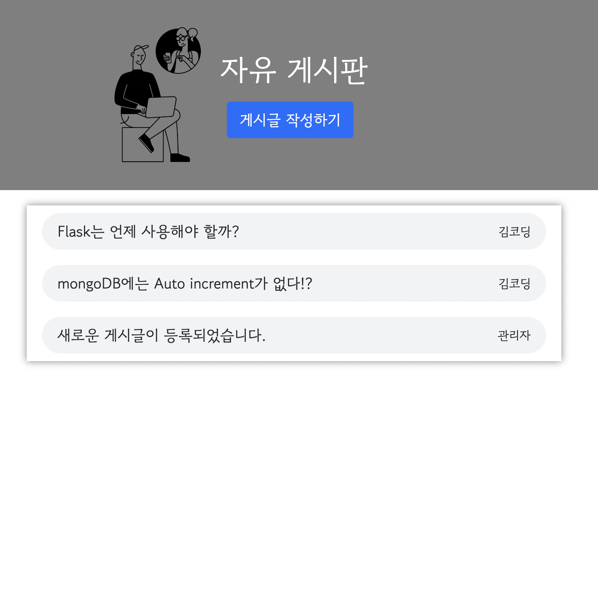

# 자유게시판
📝 누구나 글을 작성할 수 있는 자유게시판 사이트 

## 개발환경
- python 
- Flask
- MongoDB
- html
- css, bootstrap
- jQuery 

## 기능
- 게시글 작성

- 게시글 조회

메인 페이지에서 게시글을 전체 조회한다.
하나의 게시글을 클릭하면 해당 게시글의 내용을 조회한다.
- 게시글 수정

해당 게시글의 기존의 데이터를 가져온다. 
게시글의 제목과 내용만 수정할 수 있다.
- 게시글 삭제
